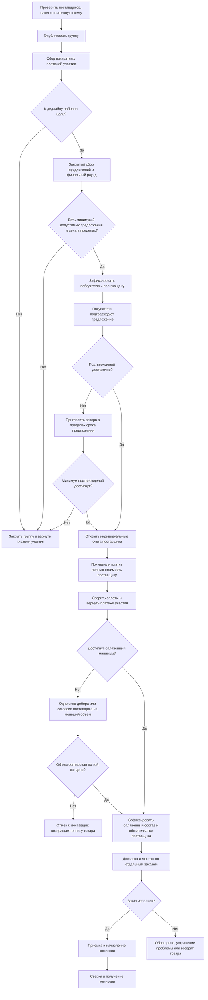
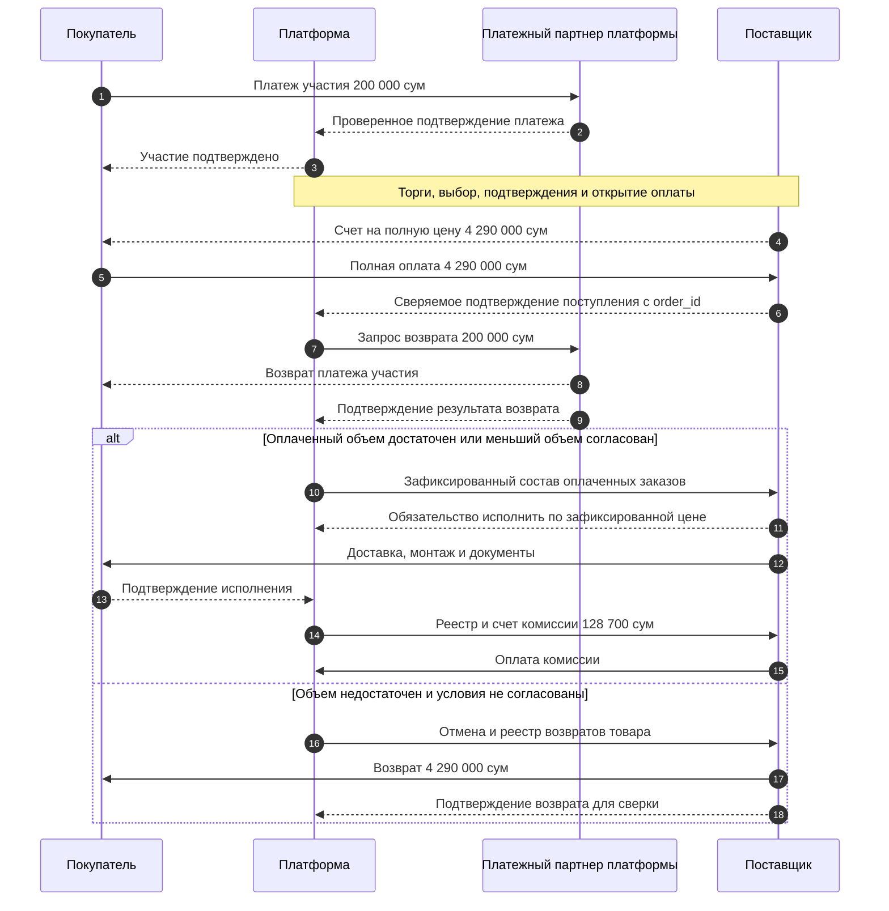
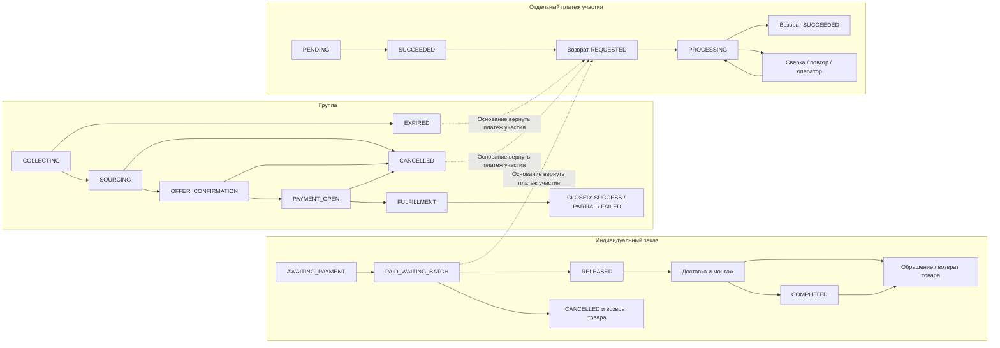
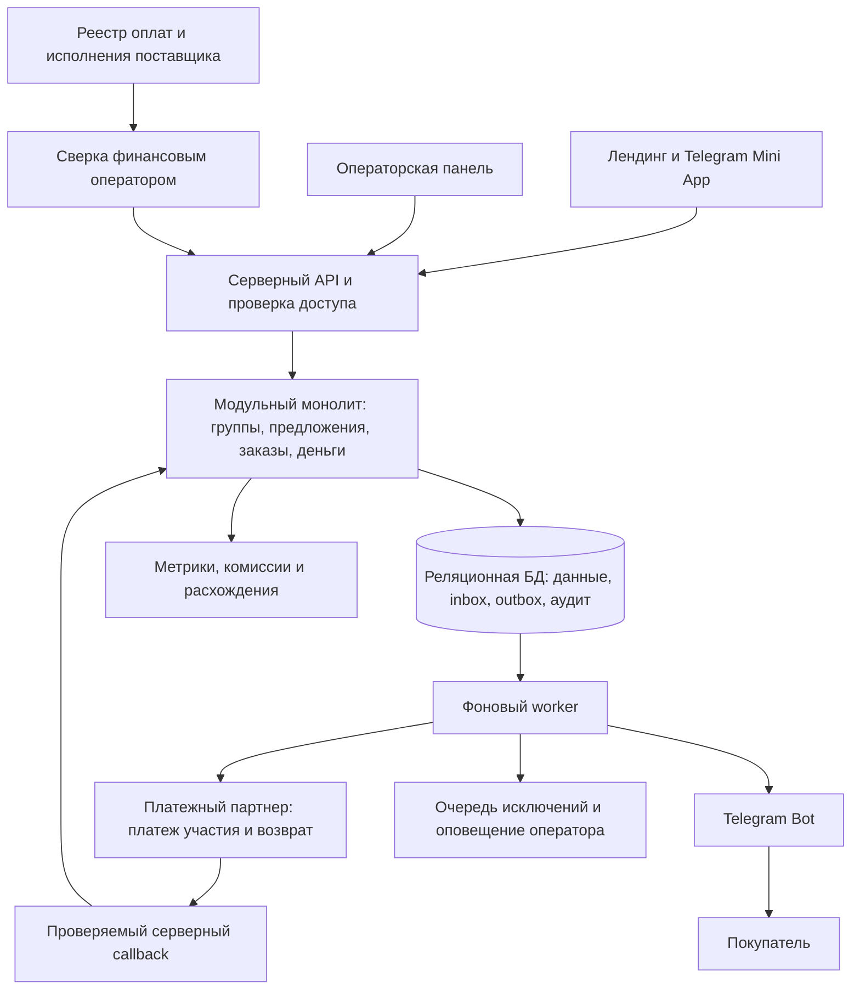
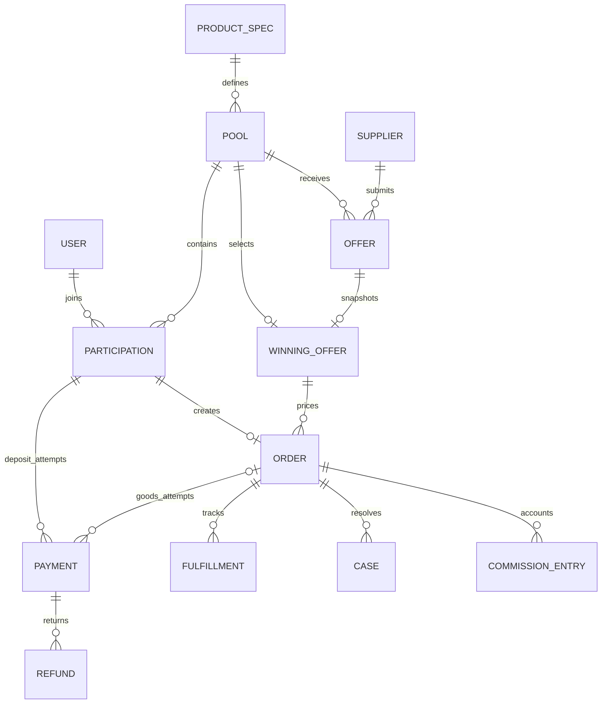

# Group Buying Uzbekistan — схемы MVP

Версия 1.0 · 15 сентября 2026. Схемы соответствуют [концепции](01-concept.md) и [ТЗ](02-technical-spec.md). Mermaid-блоки можно редактировать вместе с документами.

## 1. Общий процесс

Отказ до оплаты товара запускает полный возврат платежа участия на любом предварительном этапе. После оплаты товара возврат товара ведется отдельно. Уже исполненные заказы не отменяются из-за проблемы другого покупателя.

## 2. Движение денег на одном заказе

Временная потребность покупателя: 4 490 000 сум. После возврата платежа участия итоговый расход при успешной покупке: 4 290 000 сум. Комиссия 128 700 сум — расчет при гипотезе 3%, до расходов и налогового учета. Платформа не переводит платеж участия поставщику и не называет этот маршрут escrow.

## 3. Независимые состояния

Возврат платежа участия не отменяет оплаченный заказ. Терминальный статус группы не означает, что все ее финансовые возвраты уже завершены.

## 4. Архитектура

API платежного партнера не используется для оплаты товара в выбранном MVP. Поставщик получает полную оплату по своему счету. Вебхуки и задачи допускают повторы; уникальные ключи и сверка защищают от повторного учета и возврата.

## 5. Основные связи данных

Для Payment обязательно указать purpose и recipient. Deposit связан с участием без обязательного заказа; GOODS связан с заказом и его участием. Временные неуспешные попытки допускаются, повторное исполнение одной внешней транзакции — нет.
